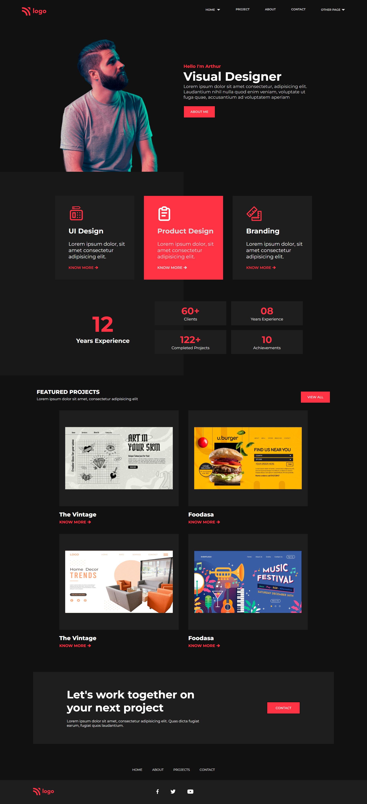

# Mohan Chindam

- Margin and flex played a vital role in placing the elements in the correct positions in this project.
- Now, I can intuitively write HTML for a particular section of the web page at a time rather than writing code for a small part at a time.
- Variations of black and red color usage at proper places helped me design web pages beautifully.
- It took nearly three and half hours to complete this project.

- Below image shows the preview of the project:

I deployed the project on **Netlify**:
- You can preview the project here, [**Product Design Landing Page**](https://product-design-landing-page-15.netlify.app/)